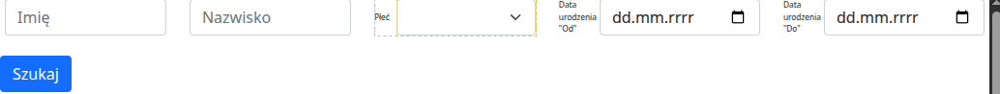
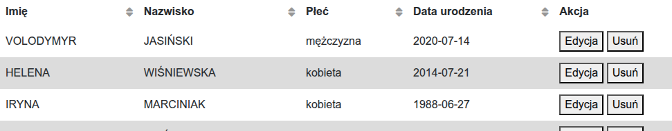

# ✅ Zadanie: Phoenix + Symfony

## ⚙️ Uruchamianie

By uruchomić samego dockera, wystarczy:
```docker
dokcer comose up
```

Ze stron:
- https://dane.gov.pl/pl/dataset/1667,lista-imion-wystepujacych-w-rejestrze-pesel-osoby-zyjace/resource/63929/table?page=1&per_page=20&q=&sort=
- https://dane.gov.pl/pl/dataset/1667,lista-imion-wystepujacych-w-rejestrze-pesel-osoby-zyjace/resource/63924/table?page=1&per_page=20&q=&sort=
- https://dane.gov.pl/pl/dataset/1681,nazwiska-osob-zyjacych-wystepujace-w-rejestrze-pesel/resource/63888/table?page=1&per_page=20&q=&sort=
- https://dane.gov.pl/pl/dataset/1681,nazwiska-osob-zyjacych-wystepujace-w-rejestrze-pesel/resource/63892/table?page=1&per_page=20&q=&sort=

Ściągnąłem pliki `csv` i nadałem im krótsze nazwy. Są w repozytorium.

Generowanie wsadu do bazy wykonałem za pomocą skryptu Elixira: `generator.exs`.

Baza danych z tymi danymi to: `phoenix_app_dev`.

## 🚗 Użycie

Standardowo na linku: http://localhost:8000/users można zobaczyć:
- formularz logowania
- tabelę z imionami i nazwiskami, wraz z przyciskami do edycji i usuwania wiersza

Wpisując w formularz:


 - imię
 - nazwisko
 - płeć
 - datę urodzenia "Od"
 - datę urodzenia "Do"

i klikając "Szukaj" dostaniemy dane ograniczone takimi warunkami wyszukiwania w tabeli poniżej.

Sortowanie też działa standardowo i jego stan jest przekazywany do wyszukiwania.



Kliknięcie "Edycja" powoduje przekierowanie do formularza edycji danego wiersza. 

Kliknięcie "Usuń" powoduje usunięcie danego wiersza i z widoku i z bazy.
